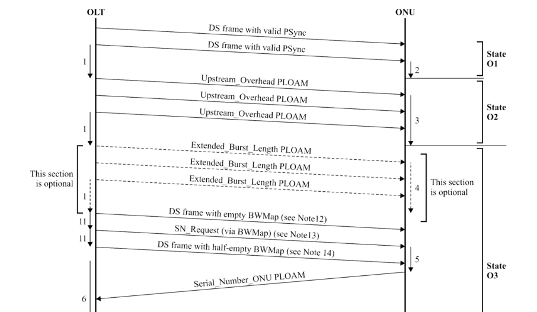
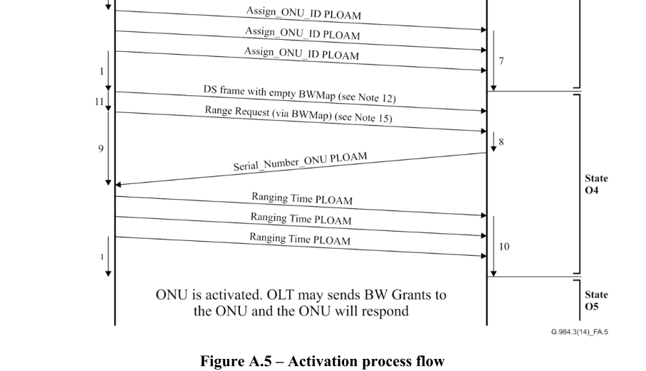
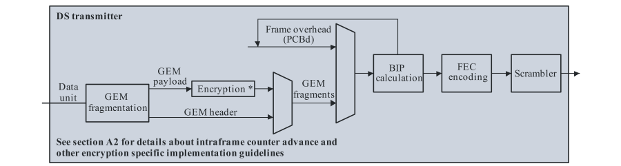
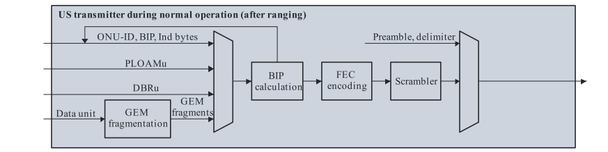
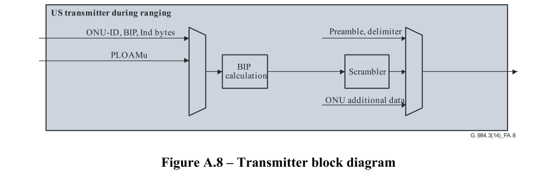

# A.6 ONU 激活流程

该条文的目的是阐明在 OLT-ONU interaction 激活期间过程的 issue 

该条文描述了OLT and ONU 在激活过程中的活动， 他们的 timing relations 和 他们之间的消息交换。

该条文根据激活状态（O1-O5）分节。每节描述了激活状态（state）期间的过程（processes）。

查看 Figure A.5 for 一个 visual example of the flow. 这个 numbers next to the downward arrows refer to the Notes below the diagram.

(Note that) 注意 在这个 cases 中 where ONU 状态（state）变化被触发（are triggered）通过（by）receptiion of a PLOAM 消息，ONU 转换它的状态（status）在第一个valid 消息它接收（在OLT发送三次（out of the 3 repetitions sent by OLT））之后， **Since** OLT is not aware of which 消息 被正确接收 通过ONU， its 从 第三个PLOAM开始 等待 750 us 的周期。在 Figure A.5 中， ONU 转换它的 states 在 一个 processing time 之后， which is demonstrated to be less than 750 us.

NOTE 1 – OLT waits at least 750 μs for the ONU to process the message. 

NOTE 2 – ONU clears LOS/LOF error. 

NOTE 3 – ONU constructs the preamble and delimiter and sets pre-assigned delay. 

NOTE 4 – ONU constructs extended preamble. 

NOTE 5 – ONU randomizes a response time and constructs Serial_Number_ONU PLOAM message. 

NOTE 6 – OLT analyses incoming PLOAMs and associates ONU-IDs with serial numbers. 

NOTE 7 – ONU stores assigned ONU-ID.

NOTE 8 – ONU prepares response PLOAM. 

NOTE 9 – OLT measures time until response is received and calculates the adjustment to the ONU's Equalization Delay. 

NOTE 10 – ONU updates its equalization delay. 

NOTE 11 – Transmissions are in consecutive frames. 

NOTE 12 – Downstream frame with empty BWmap (creates 125 μs of "quiet window"). 

NOTE 13 – BWmap should be constructed according to clause A.6.4.2. 

NOTE 14 – To complete the SN request window (per clause A.6.4.2) the first StartTime in this frame should follow the margins described in clause A.6.4.2 (approximately 2 μs). 

NOTE 15 – BWmap should be constructed according to clause A.6.4.2.

## A.6.2 State O1

## A.6.3 State O2

## A.6.4 State O3

### A6.4.1 Extended_Burst_Length PLOAM message

### A.6.4.2 Serial number request message

### A.6.4.3 Serial number response message

### A.6.4.4 Assign_ONU-ID message

## A.6.5 State O4

In this state there are three message types that are exchanged between the OLT and ONU.

### A.6.5.1 Ranging request

### A.6.5.2 Ranging response

### A.6.5.3 Ranging_Time PLOAM message

## A.7 PLOAM messages

### A.7.1 Acknowledge PLOAM message

The following seeks to clarify the structure of the upstream 'Acknowledge' PLOAM message via the following example:

  In response to the following downstream PLOAM message:

​	01 08 03 00 10 00 00 00 00 00 00 00 2A

  The ONU should respond with the following acknowledge message:

​	01 09 08 01 08 03 00 10 00 00 00 00 46

## A.8 Transmitter block diagram

Figure A.8 presents the order of operations in downstream and upstream framing.

