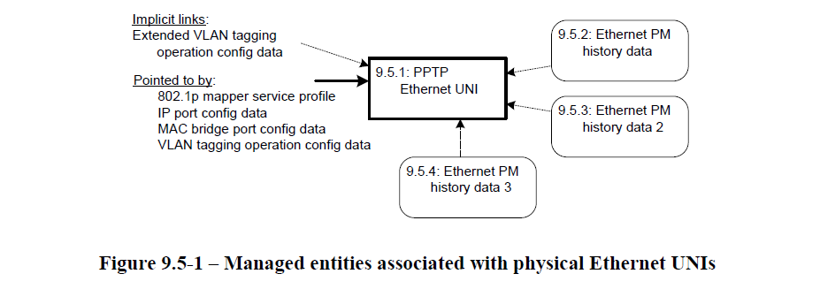
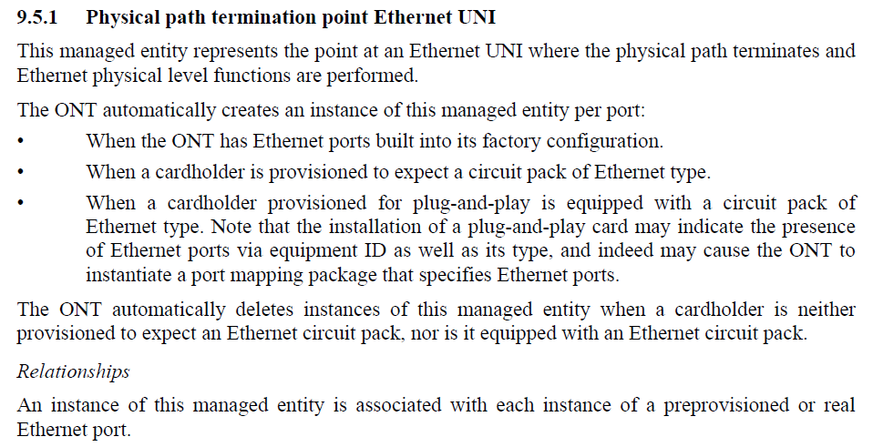

# 9.5 Ethernet services

This clause defines managed entities associated with physical Ethernet UNIs, as shown in
Figure 9.5-1.

## 9.5.1 Physical path termination point Ethernet UNI

**PPTP Ethernet UNI**

这个管理实体代表了指向一个 Ethernet UNI where 物理路径终端 和 Ethernet 物理层级 功能 被执行

ONT 自动创建 每个port 这个ME 的 一个 instance（实例）：

*  当 ONT 有 Ethernet ports built into 它的 出厂设置。
* 当 一个 cardholder 被provisioned 到 expect 一个 以太网帧格式的线路数据包
* 当

